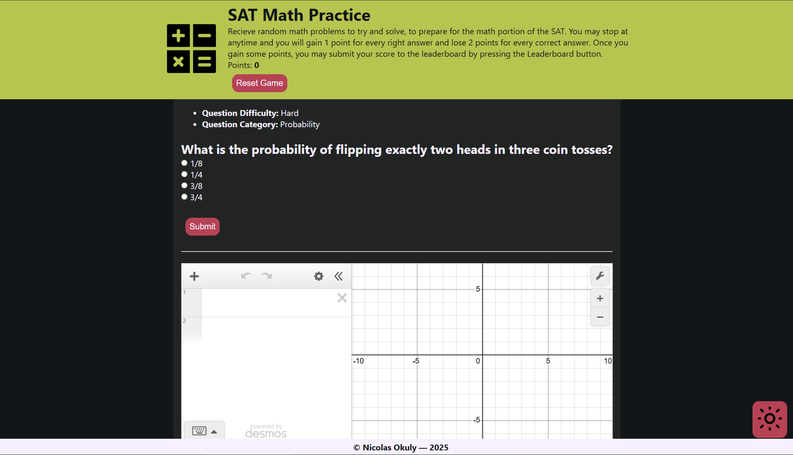

# West-MEC Capstone Project
This is a math SAT practice game. You will receive a question and a box to answer the question, if you get it wrong, the question will be explained to you as well as the answer. The game features a leaderboard to add competition and make the game more engaging.

## Homepage Preview


## External Technologies
This project utilizes some technologies outside the scope of this repo. They are listed below with links to view them.

### Google App Script
[App Script Gist](https://gist.github.com/Nicolas-Okuly/106a1cdf3a8bef50550a1e27b74ba167 "Link to view the google app script")
This web app uses a Google App Script and a Google Sheet for a leaderboard, the code to the app script is linked above in a GitHub Gist.

### Swear Word Detector
[Swear Word API](https://www.purgomalum.com/#:~:text=Contains%20Profanity%20Request "Link to the nono word detector API")
The web app also uses an API to filter leadboard submissions and disallow profanity from making it through. This method is not foolproof, if you see something, [email me](mailto:nicolasokuly@outlook.com "nicolasokuly@outlook.com")

## HTML Structure
Due to the complexity of the HTML, listed below are a few of the technologies and an example of their implementation. **IF A TECHNOLOGY DOES NOT HAVE AN EXAMPLE, ONE CAN BE FOUND IN A DIFFERENT TECHNOLOGY PRECEDING IT**

- Doctype: `<!DOCTYPE html>`
- Lang attribute: `<html lang="en"></html>`
- Meta tags: `<meta charset="UTF-8">`
- Sematic Elements: `<header>`, `<main>`
- Headings: `<h1>`
- Alt text for images: ``
- Navigation: `<a href="./leaderboard.html"><button type="button" id="leaderboard-btn">Leaderboard</button></a>`
- Forms: 
```html
<form id="answer-form">
<input type="radio" id="option1" name="math-ans" value="option1">
<label for="option1" id="option1-label">OPT1</label><br>

<input type="radio" id="option2" name="math-ans" value="option2">
<label for="option2" id="option2-label">OPT2</label><br>

<input type="radio" id="option3" name="math-ans" value="option3">
<label for="option3" id="option3-label">OPT3</label><br>

<input type="radio" id="option4" name="math-ans" value="option4">
<label for="option4" id="option4-label">OPT4</label><br>

<input type="hidden" id="problem-id" value="">

<br>
<button type="submit" id="submit-btn">Submit</button>
</form>
```
- Buttons and input elements
- Anchors
- External JS & CSS: `<link rel="stylesheet" href="./assets/styles/style.css" type="text/css" />`
- Viewport and flexible layout: `<meta name="viewport" content="width=device-width, initial-scale=1.0">`
- Responsive images
- Tables: `<table>`
- Lists: `<ul id="q-meta">`
- Comments: `<!-- Question data and answer form -->`
- Indentation and formatting
- Favicon: `<link rel="shortcut icon" href="./assets/images/math-icon.svg" type="image/x-icon">`
- HTML does work

## CSS Structure
Due to the complexity of the CSS, listed below are a few of the technologies and an example of their implementation. **IF A TECHNOLOGY DOES NOT HAVE AN EXAMPLE, ONE CAN BE FOUND IN A DIFFERENT TECHNOLOGY PRECEDING IT**

- Global reset:
```css
/* Override stuff I don't like */
body {
    padding: 15px;
    text-align: center;
}
* {
    box-sizing: border-box;
    margin: 0;
}
```
- Variables: 
```css
/* Set color variables */
:root {
    --black: #121619;
    --off-black: #212424;
    --red: #C33C54;
    --green: #B6C649;
    --blue: #4281A4;
    --white: #F8F1FF;
    --off-white: #cdcad1;
    --orange: #E57C04;    
    --gray: #514F59;
}
```
- Structure is organized: `/* Light mode (🤮) styles and overrides */`
- Responsive design: `@media screen and (max-width: 760px) {}`
- Typography: `font-family:'Segoe UI', Tahoma, Geneva, Verdana, sans-serif;`
- Color scheme:
```css
body {
    background-color: var(--black);
    color: var(--white);
    font-family:'Segoe UI', Tahoma, Geneva, Verdana, sans-serif;
}
```
- Flexbox:
```css
#header {
    background-color: var(--green);
    color: var(--black);
    padding: 5px;
    display: flex;
    justify-content: center;
    align-items: center;
    gap: 20px;
}
```
- Button styling: `button:hover { background-color: #a13145; }`
- Compontent reusability: `.dark-mode`
- Transistions: `transition: all 1s ease;`
- Hover effect: `button:hover`
- Layout containers: `#container`
- Z-Index: `z-index: 999`
- Utility classes: `.dark-mode`
- Use of pseudo-classes:
```css
*,
::after,
::before {}
```
- Shadows and borders:
```css
#modal {
    background-color: var(--white);
    color: var(--black);
    position: fixed;
    z-index: 999;
    top: 40%;
    left: 50%;
    padding: 15px;
    border-radius: 12px;
    box-shadow: 1px 1px 15px var(--white);
    transform: translate(-50%, -50%);
    display: none;
}
```
- Theme customization
- Naming conventions
- Comments and cleanlieness

## JS Structure
Due to the complexity of the JS, listed below are a few of the technologies and an example of their implementation. **IF A TECHNOLOGY DOES NOT HAVE AN EXAMPLE, ONE CAN BE FOUND IN A DIFFERENT TECHNOLOGY PRECEDING IT**

- Variable naming: `gameData`
- Function naming and modularity: `getCookie(name)`
- Arrays and object use:
```js
let gameData = {
    score: 0,
    username: "",
    currentProblem: {
        "id": 0,
        "question": "",
        "choices": ["", "", "", ""],
        "correctAnswer": "",
        "topic": "",
        "difficulty": "",
        "type": "",
        "explanation": ""
    }
}
```
- Array methods: `.map(value => value.replace(/^"|"$/g, ''))`
- Loops:
```js
dataArr.forEach(leader => {
    let usableData = leader
    .match(/(".*?"|[^,]+)(?=\s*,|\s*$)/g)
    .map(value => value.replace(/^"|"$/g, ''));

    jsonArr.push({
        "name": usableData[0],
        "score": usableData[1]
    });
});
```
- JSON Data Handling: `if (data) gameData = JSON.parse(data);`
- Web Storage:
```js
function saveGame() {
    let data = JSON.stringify(gameData);
    localStorage.setItem("gameData", data);
}
```
- Saving/Retrieving User Data:
```js
/**
 * Push gameData to storage
 */
function saveGame() {
    let data = JSON.stringify(gameData);
    localStorage.setItem("gameData", data);
}

/**
 * Load gameData from storage
 */
function loadGame() {
    let data = localStorage.getItem("gameData");
    if (data) gameData = JSON.parse(data);
}

/**
 * Destory all data
 */
function deleteSave() {
    localStorage.clear();
    window.location = window.location;
}
```
- Cookies: `document.cookie = cname + "=" + cvalue + ";" + expires + ";path=/";`
- DOM Manipulation:
```js
// Question DOM
const qQuestion = document.getElementById("q-question");
const qMeta = document.getElementById("q-meta");
const qDiff = document.getElementById("q-diff");
const qCat = document.getElementById("q-cat");

// Option DOM
const option1 = document.getElementById("option1");
const option1Label = document.getElementById("option1-label"); 
const option2 = document.getElementById("option2");
const option2Label = document.getElementById("option2-label"); 
const option3 = document.getElementById("option3");
const option3Label = document.getElementById("option3-label");
const option4 = document.getElementById("option4");
const option4Label = document.getElementById("option4-label");

// Main form DOM
const form = document.getElementById("answer-form");
const submitButton = document.getElementById("submit-btn");
const resultBox = document.getElementById("result-box");
const result = document.getElementById("q-correct");
const explanation = document.getElementById("q-explanation");
const problemId = document.getElementById("problem-id");
```
- CSS Manipulation: `form.style.display = "block";`
- Theme Preference:
```js
// Retrieve darkmode status
let dark = getCookie("darkmode");

// Set lightmode if dark and change cookie
if (dark == 0) {
    document.body.className = "light";
    img.src = "./assets/images/dark.svg";
} else {
    // Set dark mode if light and change cookie
    document.body.className = "";
    img.src = "./assets/images/light.svg"
}
```
- Comments: *seen throughout snippets*
- Error handling:
```js
async function loadBank() {
    // If it fails, error.
    try {
        problemBank = await (await fetch(`${document.location.href.split("?")[0]}/assets/bank.json`)).json();
    } catch (e) {
        throw new Error(e);
    }
}
```
- RegEx:
```js
let usableData = leader
.match(/(".*?"|[^,]+)(?=\s*,|\s*$)/g)
.map(value => value.replace(/^"|"$/g, ''));
```
- Date Object: `const accessToken = new Date().toISOString();`
- Math:
```js
const problem = problemBank[Math.floor(Math.random() * problemBank.length)];
```
- Event listeners:
```js
document.getElementById("name").addEventListener("submit", (e) => {
    e.preventDefault();
    document.getElementById("modal").style.display = "none";
    setCookie("username", e.target["name-input"].value, 7)
    saveGame();

    pushToLeaderboard(e.target["name-input"].value, gameData.score); // Note: this function is a point of no return
});
```
- Real-time search:
```js
function filterList() {
    // Get basic variables
    let input = document.getElementById("search");
    let filter = input.value.toUpperCase();
    let table = document.getElementById("leaderboard");
    let tr = table.getElementsByTagName('tr');
    let i, txtValue;

    // Handle data to parse table and clear rows.
    for (i = 0; i < tr.length; i++) {
        txtValue = tr[i].innerText
        if (txtValue.toUpperCase().indexOf(filter) > -1) {
            tr[i].style.display = "";
          } else {
            if(i==0) continue
            tr[i].style.display = "none";
          }
    }
}
```
- CRUD: Seen throughout